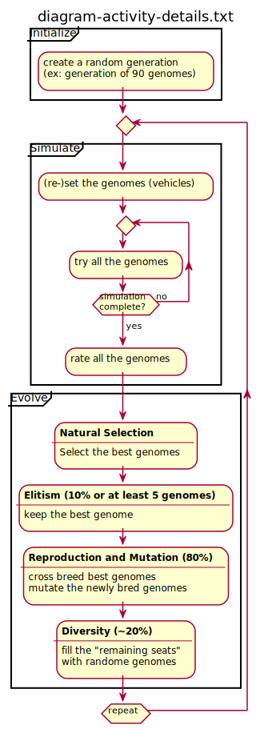
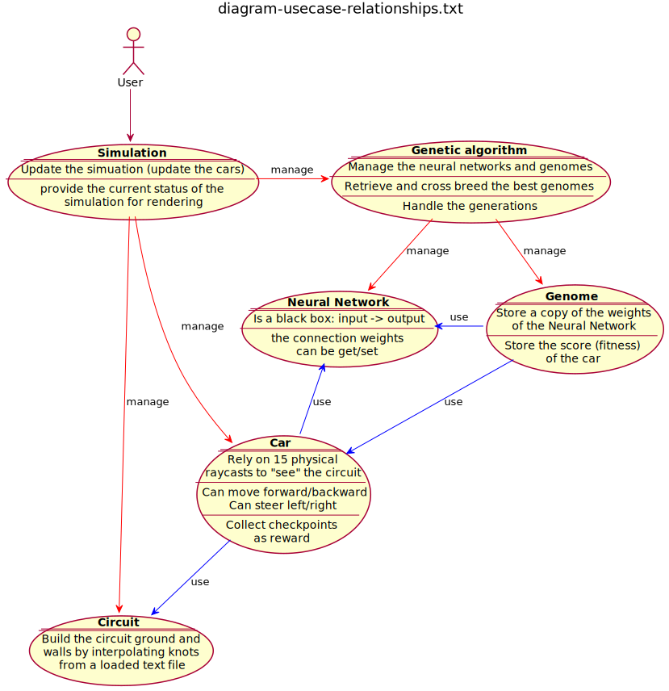
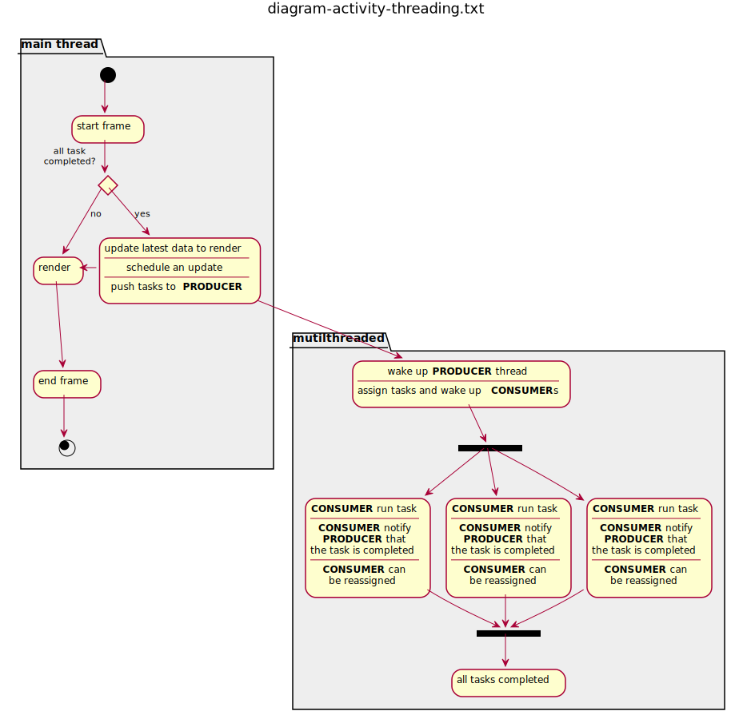

# Self Learning 3d Cars

## Table of Contents
- [Self Learning 3d Cars](#self-learning-3d-cars)
  - [Table of Contents](#table-of-contents)
  - [Emscripten Version](#emscripten-version)
    - [Online live demo 3D](#online-live-demo-3d)
    - [Diagrams](#diagrams)
  - [How to Build](#how-to-build)
  - [How to Launch - Native version](#how-to-launch---native-version)
  - [How to Launch - Web Wasm version - with multithreading support (desktop friendly)](#how-to-launch---web-wasm-version---with-multithreading-support-desktop-friendly)
  - [How to Launch - Web Wasm version - without multithreading support: webworkers (mobile friendly)](#how-to-launch---web-wasm-version---without-multithreading-support-webworkers-mobile-friendly)
- [Thanks for watching!](#thanks-for-watching)

## Emscripten Version

### Online live demo 3D

http://guillaumebouchetepitech.github.io/self-learning-3d-cars/dist/index.html

### Diagrams





## How to Build

```bash
sh sh_build.sh
```

## How to Launch - Native version

```
./bin/exec
```

## How to Launch - Web Wasm version - with multithreading support (desktop friendly)

```bash
node dumbFileServer.js # launch the file server
```

then use **firefox/chrome browser (desktop adviseable)** to load `http://127.0.0.1:9001/dist/index.html`

## How to Launch - Web Wasm version - without multithreading support: webworkers (mobile friendly)

```bash
node dumbFileServer.js # launch the file server
```

then use **firefox/chrome browser (should support desktop and mobile)** to load `http://127.0.0.1:9000/dist/index.html`


# Thanks for watching!
