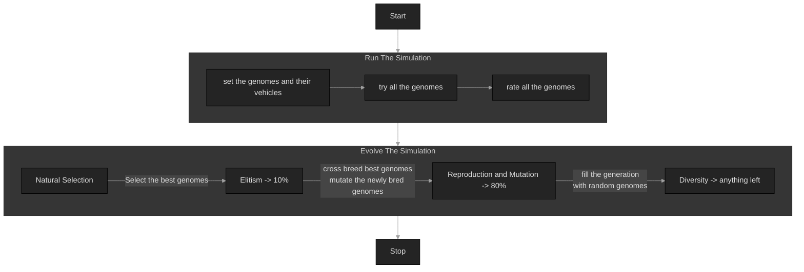
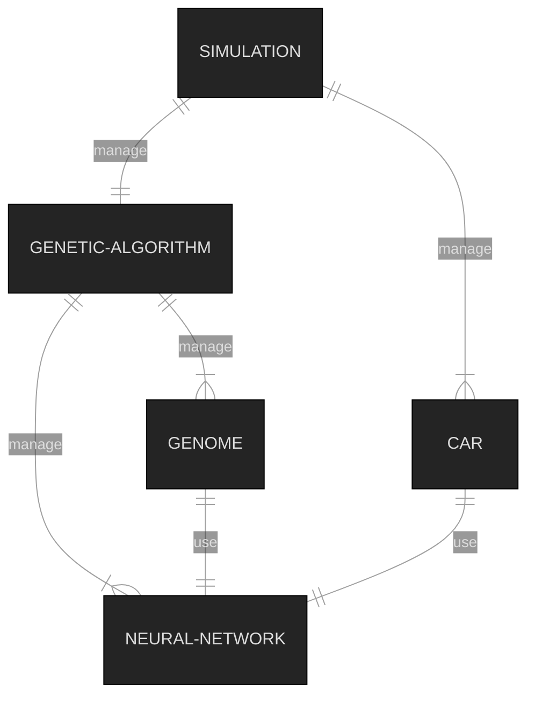

# Self Learning 3d Cars

## Table of Contents
- [Self Learning 3d Cars](#self-learning-3d-cars)
  - [Table of Contents](#table-of-contents)
  - [Online Demo Link](#online-demo-link)
  - [Diagrams](#diagrams)
    - [Main Logic](#main-logic)
    - [Relationships](#relationships)
    - [Mutilthreaded Producer Consumer Pattern](#mutilthreaded-producer-consumer-pattern)
- [Dependencies](#dependencies)
  - [Dependency: Emscripten 3.1.26 (for web-wasm build)](#dependency-emscripten-3126-for-web-wasm-build)
  - [Dependency: SDL2, GLESv2 (for native build)](#dependency-sdl2-glesv2-for-native-build)
  - [Dependency: Geronimo 0.0.12](#dependency-geronimo-0012)
  - [Dependency: Basic Genetic Algorithm 0.0.7](#dependency-basic-genetic-algorithm-007)
- [How to Build](#how-to-build)
  - [Build Everything (will skip web-wasm if emscripten is absent)](#build-everything-will-skip-web-wasm-if-emscripten-is-absent)
- [How to Run](#how-to-run)
  - [Native Build](#native-build)
  - [Web Wasm Build - without multithreading support: webworkers (mobile friendly)](#web-wasm-build---without-multithreading-support-webworkers-mobile-friendly)
  - [Web Wasm Build - with multithreading support (desktop friendly)](#web-wasm-build---with-multithreading-support-desktop-friendly)
- [Thanks for watching!](#thanks-for-watching)

## Online Demo Link

**`/!\ important /!\`**

http://guillaumebouchetepitech.github.io/self-learning-3d-cars/dist/index.html

**`/!\ important /!\`**

## Diagrams


### Main Logic



### Relationships



### Mutilthreaded Producer Consumer Pattern

```mermaid

%%{
  init: {
    'theme': 'base',
    'themeVariables': {
      'primaryColor': '#242424',
      'primaryTextColor': '#DDD',
      'primaryBorderColor': '#000',
      'lineColor': '#A0A0A0',
      'secondaryColor': '#454545',
      'tertiaryColor': '#353535'
    }
  }
}%%

  sequenceDiagram

    autonumber

    participant MT as Main Thread
    participant P as Producer
    participant PT as Producer Thread
    participant CT as Consumer Thread


    rect rgb(32, 32, 32)

      rect rgb(64, 64, 64)

        MT->>+P: push task(s) to run in parallel

        rect rgb(128, 64, 64)

          Note over P: Thread Safe On
          P->>P: store new task
          P->>+PT: notify
          Note over P: Thread Safe Off

        end

      end

      rect rgb(128, 64, 64)

        Note over PT: Thread Safe On

        PT->>PT: wake up

        loop Until no more task to assign

          PT->>PT: check for available task(s)

          critical no more tasks

            PT-->>P: all tasks completed

            P-->>-MT: all tasks completed

          option a task was found

            PT->>PT: check for available consumer(s)


            break a consumer is available

              PT->>CT: assign task to run
              PT->>+CT: notify

            end

          end

        end

        PT->>-PT: sleep

        Note over PT: Thread Safe Off

      end

      rect rgb(64, 64, 64)

        CT->>CT: wake up
        CT->>CT: run task

        rect rgb(128, 64, 64)

          Note over CT: Thread Safe On
          CT->>CT: task completed
          CT-->>PT: set task as completed
          CT-->>PT: notify
          CT->>-CT: sleep
          Note over CT: Thread Safe Off

        end

      end


    end

```



# Dependencies

## Dependency: Emscripten 3.1.26 (for web-wasm build)
```bash
git clone https://github.com/emscripten-core/emsdk.git

cd emsdk

./emsdk install 3.1.26
./emsdk activate --embedded 3.1.26

. ./emsdk_env.sh

em++ --clear-cache
```

## Dependency: SDL2, GLESv2 (for native build)
```
libsdl2-dev
libglesv2
```

## Dependency: Geronimo 0.0.12

[Github Link](https://github.com/GuillaumeBouchetEpitech/geronimo)

This dependency will be downloaded and built with the `Build Everything` method below

## Dependency: Basic Genetic Algorithm 0.0.7

[Github Link](https://github.com/GuillaumeBouchetEpitech/basic-genetic-algorithm)

This dependency will be downloaded and built with the `Build Everything` method below

# How to Build

## Build Everything (will skip web-wasm if emscripten is absent)

```bash
chmod +x ./sh_everything.sh
./sh_everything.sh
# will tell if a dependency is missing
# will skip the web-wasm build if emscripten is not detected
```

# How to Run

## Native Build

```
./bin/exec
```

## Web Wasm Build - without multithreading support: webworkers (mobile friendly)

```bash
node dumbFileServer.js # launch the file server
```

then use **firefox/chrome browser (should support desktop and mobile)** to load `http://127.0.0.1:9000/dist/index.html`

## Web Wasm Build - with multithreading support (desktop friendly)

```bash
node dumbFileServer.js # launch the file server
```

then use **firefox/chrome browser (desktop advisable)** to load `http://127.0.0.1:9001/dist/index.html`


# Thanks for watching!
